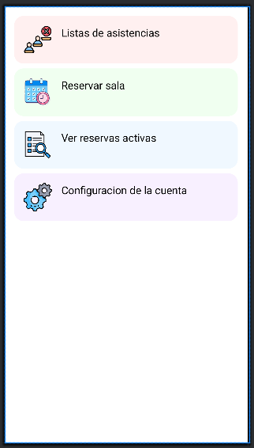
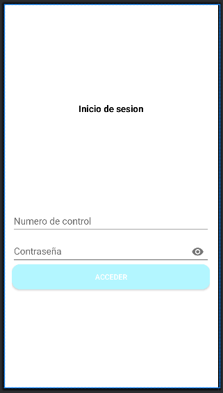
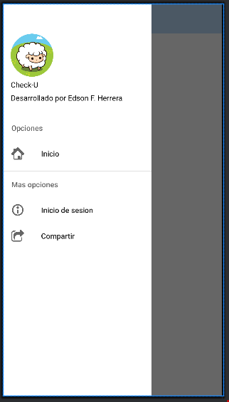
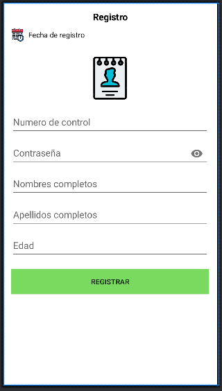
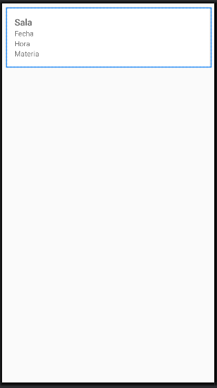

# asistenciagps
App Android para registrar asistencias mediante escaneo QR y verificación por GPS. Asocia al alumno con profesor, materia y aula. En desarrollo una adaptación para mostrar en tiempo real la ubicación y llegada estimada de autobuses.

